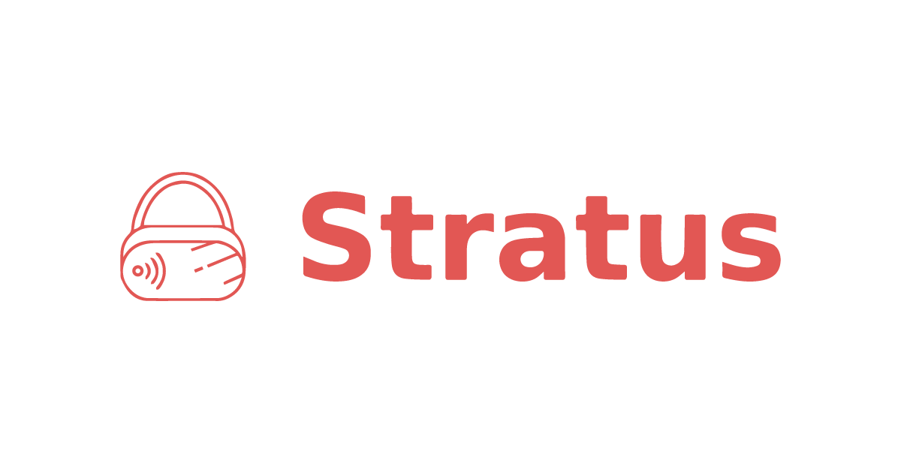

# Stratus VR

Thank you for your interest in Stratus! We're hard at work building out our platform, but we wanted to invite a select few users to be the some of the first to try it out. 

Please note that this beta test is an early-stage build of our platform and may not reflect what the final product will look like or function. You may encounter bugs or technical issues during this beta test, this is to be expected. We ask that you let us know of any issues you encounter through this form. 

## Prerequisites
1. A Meta Quest or Meta Quest 2 Headset with developer mode enabled (https://developer.oculus.com/documentation/native/android/mobile-device-setup/)
2. A PC/Mac/Linux computer installed with Python and Android Device Bridge (https://www.vrtourviewer.com/docs/adb/)
3. An internet speed of 50+ Mbps

## Installation Instructions
1. Ensure Python and Android Device Bridge are installed on your computer, and that your headset is connected with the USB-C cord.
2. Clone the repository: <code>git clone https://github.com/stratusvr/stratus-app</code>
3. Enter the directory and install the required packages: <code>pip install -r requirements.txt</code>
4. Run the application: <code>python main.py</code>

## Usage Instructions
1. Visit https://main.d3vh7zst60d70i.amplifyapp.com/
2. Sign up for an account, log in, and proceed to the dashboard.
3. Start your Stratus session by clicking the <code>Launch Session</code> button.
4. Note the IP address provided (you can retrieve it using the <code>Retrieve IP Address</code> button).
5. Access your running Stratus desktop application.
6. Install the Stratus VR application on your headset by clicking the <code>Install Application</code> button.
7. Enter the IP address from the website into the text box, then click the <code>Push to Headset</code> button.
8. Launch the CloudXR application on your headset (located in the "Unidentified Developers" section of your library). <code>NOTE: Wait at least 5 minutes after starting your Stratus session before launching the VR application.</code>
9. The application may crash on its first launch; if so, try launching it again to connect to your Stratus session.
10. Once connected, you will see the SteamVR 'Void.'
11. While in the 'Void,' open the SteamVR menu (left menu button).
12. Launch Adventure Climb VR and start playing.
13. Your session will automatically terminate after 30 minutes.
